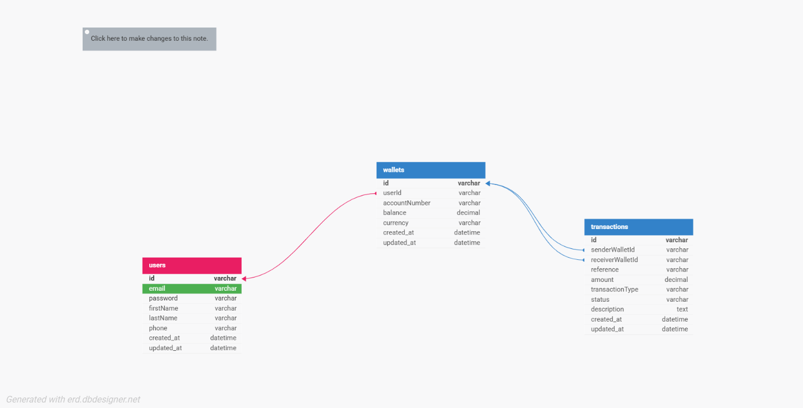

# Lendsqr Backend Assessment

## About Project
This project is a back-end service for a demo credit-tech application. It provides functionalities for user account management and wallet operations. The service includes:
- **User Signup & Login**: Secure authentication flow with JWT.
- **Credit Check Integration**: Integration with the Adjutor API to verify user credit history during registration.
- **Wallet Services**: Core wallet functionality including funding, transfers, and withdrawals.
- **Data Integrity**: Robust handling of financial transactions using SQL transactions and concurrency control.

## Tech Stack Used
- **Language**: TypeScript
- **Runtime**: Node.js
- **Framework**: Express.js
- **Database**: MySQL (relational database)
- **Query Builder**: Knex.js
- **Dependency Injection**: TypeDI
- **Documentation**: Swagger UI
- **Containerization**: Docker & Docker Compose
- **Testing**: Mocha, Chai, and Sinon

## Entity Relationship Diagram (ERD)
The database schema consists of three main entities: `users`, `wallets`, and `transactions`.



## How to execute the project

### Prerequisites
- [Node.js](https://nodejs.org/) (optional, if running without Docker).

### Running Locally (Development)
1. **Navigate to the backend directory**:
   ```bash
   cd backend
   ```

2. **Install dependencies**:
   ```bash
   npm install
   ```

3. **Run database migrations**:
   ```bash
   npm run migrate
   ```

4. **Start the development server**:
   ```bash
   npm run dev
   ```

### Running Tests
To verify the implementation, run the automated test suite:
```bash
npm test
```

### API Documentation
Once the server is running, you can explore the API endpoints using Swagger UI at:
`http://localhost:3000/api/docs`